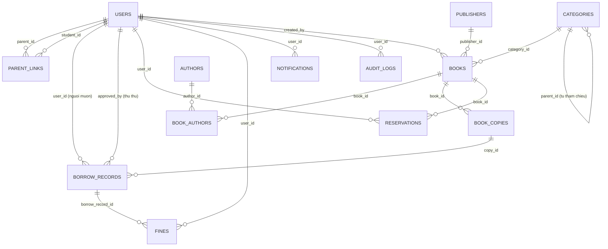
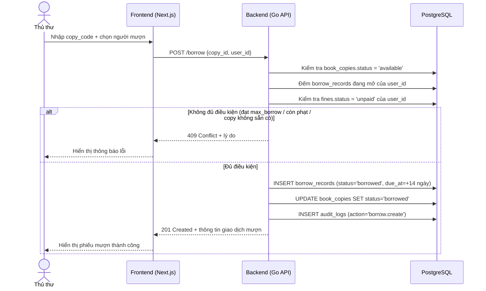
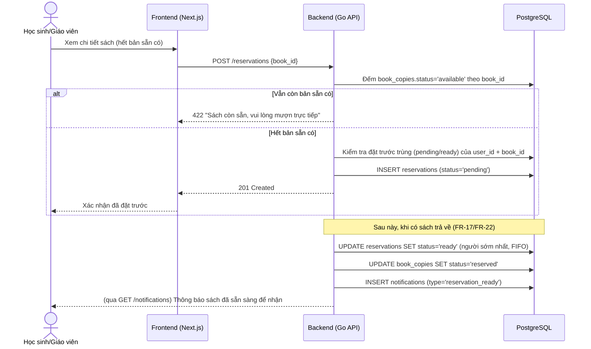

# SRS — Đặc tả Yêu cầu Phần mềm Hệ thống Quản lý Thư viện Trường học

| | |
|---|---|
| **Tên dự án** | Hệ thống Quản lý Thư viện Trường học (thuvientruong) |
| **Phiên bản tài liệu** | 1.0 |
| **Ngày ban hành** | 17/09/2026 |
| **Trạng thái** | Chốt để làm căn cứ phát triển MVP |
| **Miền triển khai** | https://thuvien.vietsoftware.vn |

---

## 1. Giới thiệu

### 1.1. Mục đích tài liệu

Tài liệu này đặc tả đầy đủ yêu cầu chức năng và phi chức năng của Hệ thống Quản lý Thư viện Trường học, làm căn cứ thống nhất giữa các bên liên quan (nhà trường, thủ thư, đội phát triển) trong suốt vòng đời thiết kế, xây dựng, kiểm thử và nghiệm thu sản phẩm. Tài liệu được viết theo cấu trúc chuẩn kết hợp IEEE 830 và ISO/IEC/IEEE 29148, dựa trên hai tài liệu đã chốt trước đó:

- `docs/API.md` — hợp đồng API (API contract) giữa frontend và backend.
- `backend/migrations/0001_init.sql` — lược đồ cơ sở dữ liệu PostgreSQL khởi tạo.

Mọi yêu cầu trong tài liệu này phải nhất quán với hai tài liệu trên; khi có khác biệt, API.md và schema DB là nguồn chân lý (source of truth) về mặt kỹ thuật, còn tài liệu này bổ sung ngữ cảnh nghiệp vụ, quy tắc, tiêu chí chấp nhận mà hai tài liệu kia không nêu chi tiết.

### 1.2. Phạm vi dự án

Hệ thống là một ứng dụng web quản lý toàn bộ hoạt động nghiệp vụ của thư viện trong một trường học (phổ thông), bao gồm:

- Quản lý danh mục đầu sách/ấn phẩm (sách, tạp chí, báo, luận văn...) và các bản sao vật lý của từng đầu sách.
- Quản lý quy trình mượn — trả — gia hạn — đặt trước sách giữa thủ thư và người đọc (giáo viên, học sinh).
- Quản lý phạt phát sinh do trễ hạn, mất sách, hư hỏng sách.
- Quản lý người dùng theo 5 vai trò với phân quyền khác nhau.
- Thông báo nhắc hạn trả và thông báo sách đặt trước đã sẵn sàng.
- Báo cáo thống kê phục vụ công tác quản lý của nhà trường và thủ thư.
- Cổng thông tin cho phụ huynh theo dõi tình trạng mượn/phạt của con em.

**Ngoài phạm vi (out of scope) của phiên bản MVP**: mượn sách tự phục vụ qua máy quét mã vạch/QR không cần thủ thư thao tác, gửi SMS/email thực tế (chỉ có thông báo trong hệ thống — in-app), ứng dụng di động riêng, tích hợp thanh toán trực tuyến cho phạt, tích hợp với hệ thống quản lý học sinh (SIS) của trường. Các hạng mục này được liệt kê ở mục 10 — Lộ trình phát triển tương lai.

Hệ thống được triển khai trên một máy macOS cá nhân đặt tại trường/đơn vị vận hành, expose ra Internet qua Cloudflare Tunnel tại domain `thuvien.vietsoftware.vn`, tự khởi động lại tiến trình khi máy khởi động lại nhờ `launchd`.

### 1.3. Định nghĩa, từ viết tắt và thuật ngữ

| Thuật ngữ | Giải thích |
|---|---|
| SRS | Software Requirements Specification — Đặc tả yêu cầu phần mềm |
| MVP | Minimum Viable Product — Sản phẩm khả dụng tối thiểu |
| FR | Functional Requirement — Yêu cầu chức năng |
| NFR | Non-Functional Requirement — Yêu cầu phi chức năng |
| Đầu sách (book) | Bản ghi mô tả một tựa ấn phẩm (sách, tạp chí, báo, luận văn...), không gắn với một bản in vật lý cụ thể |
| Bản sao (book copy) | Một bản in/hiện vật vật lý cụ thể của một đầu sách, có mã vạch/số đăng ký cá biệt riêng (`copy_code`), có thể mượn/trả độc lập với các bản sao khác của cùng đầu sách |
| Mượn (borrow) | Giao dịch một bản sao được giao cho một người dùng mượn về, có hạn trả |
| Đặt trước (reservation) | Yêu cầu giữ chỗ cho một đầu sách khi tất cả bản sao hiện đang được mượn hết |
| Phạt (fine) | Khoản tiền người mượn phải nộp do vi phạm quy định mượn trả (trễ hạn, mất, hư hỏng) |
| RBAC | Role-Based Access Control — Kiểm soát truy cập theo vai trò |
| JWT | JSON Web Token — chuẩn token dùng để xác thực |
| Cloudflare Tunnel | Dịch vụ của Cloudflare cho phép expose dịch vụ chạy nội bộ (localhost) ra Internet an toàn mà không cần mở port trực tiếp trên router |
| launchd | Trình quản lý tiến trình nền (daemon/service) mặc định của macOS, dùng để tự khởi chạy và giám sát ứng dụng |
| pgx | Thư viện driver PostgreSQL hiệu năng cao cho ngôn ngữ Go |
| copy_code | Mã vạch/số đăng ký cá biệt định danh duy nhất một bản sao vật lý |

Các vai trò người dùng dùng xuyên suốt tài liệu, theo đúng `user_role` trong schema: `admin`, `librarian`, `teacher`, `student`, `parent`.

### 1.4. Tài liệu tham chiếu

1. `docs/API.md` — API Contract (đã chốt).
2. `backend/migrations/0001_init.sql` — Schema cơ sở dữ liệu PostgreSQL khởi tạo (đã chốt).
3. IEEE Std 830-1998 — Recommended Practice for Software Requirements Specifications.
4. ISO/IEC/IEEE 29148:2018 — Systems and software engineering — Life cycle processes — Requirements engineering.

---

## 2. Mô tả tổng quan

### 2.1. Bối cảnh hệ thống

Thư viện trường học hiện quản lý sách và quá trình mượn/trả theo cách thủ công hoặc bằng bảng tính rời rạc, dẫn đến khó khăn trong việc: tra cứu sách còn hay đã hết, theo dõi ai đang mượn sách gì và có trễ hạn hay không, tính toán phạt, và cung cấp thông tin cho phụ huynh. Hệ thống mới số hóa toàn bộ nghiệp vụ trên vào một ứng dụng web tập trung, vận hành nội bộ trong phạm vi trường nhưng có thể truy cập từ xa qua Internet (ví dụ phụ huynh xem tình trạng con em tại nhà).

Hệ thống gồm ba lớp chính:
- **Frontend**: ứng dụng Next.js (App Router, TypeScript, Tailwind CSS) — giao diện người dùng, chạy trên cổng 3400.
- **Backend**: API Go (kiểu tổ chức module/router theo phong cách "bvote", xác thực JWT, kết nối PostgreSQL qua `pgx`) — xử lý nghiệp vụ, chạy trên cổng 8190.
- **Database**: PostgreSQL, tên database `thuvien`.

Toàn bộ được triển khai trên một máy macOS cá nhân, các tiến trình được `launchd` quản lý để tự khởi động lại khi máy khởi động lại hoặc khi tiến trình bị crash; truy cập công khai qua Internet được thực hiện thông qua Cloudflare Tunnel tại domain `thuvien.vietsoftware.vn`, không mở port trực tiếp ra ngoài.

### 2.2. Đối tượng sử dụng và vai trò

Hệ thống có 5 vai trò người dùng, ánh xạ trực tiếp với kiểu liệt kê `user_role` trong CSDL. Bảng dưới đây tổng hợp mô tả nghiệp vụ và quyền hạn (chi tiết quyền theo API xem bảng phân quyền cuối `docs/API.md`):

| Vai trò | Đại diện cho | Mô tả vai trò trong hệ thống |
|---|---|---|
| `admin` | Nhà trường / Quản trị hệ thống | Toàn quyền: quản lý tài khoản người dùng (tạo/sửa/khoá, đặt lại mật khẩu, liên kết phụ huynh–học sinh), toàn quyền trên danh mục và sách, xem toàn bộ báo cáo, duyệt miễn phạt |
| `librarian` | Thủ thư | Vận hành nghiệp vụ hằng ngày: quản lý đầu sách và bản sao, xử lý mượn/trả/gia hạn/đặt trước, thu và miễn phạt, tạo tài khoản học sinh/giáo viên, xem báo cáo |
| `teacher` | Giáo viên | Tra cứu danh mục sách, tự đặt trước sách, xem lịch sử mượn/phạt của bản thân, nhận thông báo |
| `student` | Học sinh | Tra cứu danh mục sách, tự đặt trước sách, xem lịch sử mượn/phạt của bản thân, nhận thông báo |
| `parent` | Phụ huynh | Chỉ xem: tra cứu danh mục sách (read-only), xem tình trạng mượn/phạt của (các) con đã được liên kết, không thao tác mượn/trả/đặt trước |

Một người dùng chỉ có duy nhất một vai trò (trường `role` trong bảng `users`). Quan hệ phụ huynh–học sinh là nhiều–nhiều, lưu trong bảng `parent_links` (một phụ huynh có thể theo dõi nhiều con; một học sinh về lý thuyết có thể được nhiều phụ huynh theo dõi).

### 2.3. Ràng buộc chung

- Ngôn ngữ giao diện: tiếng Việt duy nhất trong MVP.
- Xác thực bắt buộc cho mọi chức năng trừ đăng nhập; không có luồng đăng ký tự do — tài khoản được `admin` hoặc `librarian` khởi tạo.
- Mỗi học sinh có `max_borrow` (mặc định 3) là số bản sao tối đa được mượn cùng lúc.
- Hệ thống chỉ quản lý một thư viện của một trường (không hỗ trợ multi-tenant trong MVP).
- Toàn bộ thao tác ghi dữ liệu nghiệp vụ quan trọng phải được ghi vào `audit_logs`.

### 2.4. Giả định và phụ thuộc

- Nhà trường cung cấp danh sách học sinh/giáo viên ban đầu (nhập tay hoặc import) để `admin`/`librarian` tạo tài khoản.
- Máy chủ triển khai (macOS cá nhân) có kết nối Internet ổn định và luôn bật (hoặc được đánh thức định kỳ) để duy trì Cloudflare Tunnel.
- Đã cài đặt sẵn PostgreSQL, Go runtime, Node.js/Next.js build tooling, và `cloudflared` trên máy triển khai.
- Không có yêu cầu tuân thủ pháp lý đặc thù ngoài bảo vệ thông tin cá nhân học sinh ở mức hợp lý cho môi trường giáo dục nội bộ (không xử lý dữ liệu thanh toán thật, không yêu cầu chuẩn PCI-DSS).
- Thời gian hệ thống lấy theo múi giờ Việt Nam (Asia/Ho_Chi_Minh); các cột `timestamptz` trong DB lưu UTC, quy đổi hiển thị tại tầng frontend/backend.

---

## 3. Yêu cầu chức năng

Mỗi yêu cầu chức năng (FR) trình bày theo mẫu: **Mã, Mô tả, Actor, Đầu vào/Đầu ra, Quy tắc nghiệp vụ, Tiêu chí chấp nhận**. Các API tương ứng tham chiếu tới `docs/API.md`.

### 3.1. Module: Quản lý người dùng & phân quyền

#### FR-01 — Đăng nhập hệ thống
- **Mô tả**: Người dùng đăng nhập bằng email và mật khẩu để nhận access token và phiên làm việc.
- **Actor**: Tất cả vai trò.
- **Đầu vào**: `{email, password}`.
- **Đầu ra**: `access_token` (JWT, hiệu lực 15 phút), thông tin `user`; `refresh_token` (hiệu lực 7 ngày) đặt vào cookie `HttpOnly`.
- **Quy tắc nghiệp vụ**:
  - Mật khẩu lưu dạng băm (hash), không bao giờ lưu/trả về dạng plaintext.
  - Tài khoản ở trạng thái `suspended`/`disabled` không được đăng nhập.
  - Sai quá nhiều lần liên tiếp trong khoảng thời gian ngắn phải bị giới hạn tốc độ (rate-limit) để chống brute-force.
- **Tiêu chí chấp nhận**:
  - Đăng nhập đúng thông tin trả về access token hợp lệ và cookie refresh token; đăng nhập sai trả lỗi 401 với thông báo chung chung (không tiết lộ email tồn tại hay không).
  - Access token hết hạn sau 15 phút phải được làm mới qua `POST /auth/refresh` mà không yêu cầu đăng nhập lại, miễn refresh token còn hiệu lực.

#### FR-02 — Làm mới phiên và đăng xuất
- **Mô tả**: Làm mới access token từ refresh token cookie; đăng xuất xoá cookie phiên.
- **Actor**: Tất cả vai trò đã đăng nhập.
- **Quy tắc nghiệp vụ**: Refresh token chỉ đọc từ cookie `HttpOnly`, không truyền qua body/query. Đăng xuất phải vô hiệu hoá phiên hiện tại phía server nếu có cơ chế lưu trạng thái phiên.
- **Tiêu chí chấp nhận**: Sau khi logout, gọi lại `/auth/refresh` với cookie cũ phải thất bại.

#### FR-03 — Xem hồ sơ cá nhân
- **Mô tả**: Người dùng xem thông tin hồ sơ của chính mình (`GET /me`).
- **Actor**: Tất cả vai trò.
- **Đầu ra**: Thông tin cơ bản (họ tên, email, vai trò, lớp/mã học sinh nếu là student, `max_borrow`).

#### FR-04 — Quản trị tài khoản người dùng
- **Mô tả**: Tạo, xem danh sách, xem chi tiết, cập nhật tài khoản người dùng.
- **Actor**: `admin` (toàn quyền tạo mọi vai trò); `librarian` (chỉ tạo được `student`/`teacher`, không tạo được `admin`/`librarian`).
- **Đầu vào**: `GET /users?role=&q=&page=`, `POST /users`, `GET /users/:id`, `PATCH /users/:id`.
- **Quy tắc nghiệp vụ**:
  - Email là duy nhất trong hệ thống (ràng buộc `UNIQUE` trên `users.email`).
  - `librarian` gọi `POST /users` với `role` khác `student`/`teacher` phải bị từ chối (403).
  - `student_code`, `class_name` chỉ áp dụng ý nghĩa cho vai trò `student` nhưng cột vẫn cho phép NULL với vai trò khác.
- **Tiêu chí chấp nhận**: Tạo trùng email trả lỗi 409; tìm kiếm theo `q` khớp họ tên hoặc email; phân trang hoạt động đúng với tham số `page`.

#### FR-05 — Đặt lại mật khẩu
- **Mô tả**: `admin` đặt lại mật khẩu cho một tài khoản bất kỳ (`POST /users/:id/reset-password`).
- **Actor**: `admin`.
- **Quy tắc nghiệp vụ**: Mật khẩu mới được sinh ngẫu nhiên hoặc do admin nhập, luôn được băm trước khi lưu; nên buộc người dùng đổi mật khẩu ở lần đăng nhập kế tiếp (khuyến nghị thiết kế, không bắt buộc schema).
- **Tiêu chí chấp nhận**: Sau khi reset, mật khẩu cũ không còn đăng nhập được.

#### FR-06 — Liên kết phụ huynh–học sinh
- **Mô tả**: Gán một phụ huynh theo dõi một học sinh (`POST /users/:id/link-parent`).
- **Actor**: `admin`.
- **Đầu vào**: `{parent_id}` gửi tới endpoint của học sinh (`:id` = student_id).
- **Quy tắc nghiệp vụ**: Ghi vào bảng `parent_links (parent_id, student_id)`; `parent_id` phải là user có `role = 'parent'`, `:id` phải là user có `role = 'student'`; cặp (parent_id, student_id) là khoá chính nên không thể liên kết trùng.
- **Tiêu chí chấp nhận**: Liên kết trùng trả lỗi 409; liên kết sai vai trò (ví dụ gán một `teacher` làm phụ huynh) trả lỗi 422.

### 3.2. Module: Quản lý danh mục (tác giả, nhà xuất bản, thể loại)

#### FR-07 — CRUD Nhà xuất bản (publishers)
- **Actor**: đọc — mọi vai trò đã đăng nhập; ghi (tạo/sửa/xoá) — `librarian`, `admin`.
- **Quy tắc nghiệp vụ**: Tên nhà xuất bản duy nhất (`UNIQUE`); không cho xoá nhà xuất bản đang được tham chiếu bởi ít nhất một đầu sách (ràng buộc `ON DELETE SET NULL` cho phép xoá về mặt kỹ thuật, nhưng nghiệp vụ nên cảnh báo/xác nhận trước khi xoá vì sách liên quan sẽ mất liên kết).
- **Tiêu chí chấp nhận**: Tạo trùng tên trả lỗi 409.

#### FR-08 — CRUD Tác giả (authors)
- **Actor**: đọc — mọi vai trò; ghi — `librarian`, `admin`.
- **Quy tắc nghiệp vụ**: Một đầu sách có thể có nhiều tác giả và một tác giả có thể viết nhiều sách (quan hệ nhiều–nhiều qua `book_authors`). Xoá tác giả sẽ xoá luôn các liên kết `book_authors` tương ứng (`ON DELETE CASCADE`) nhưng không xoá đầu sách.
- **Tiêu chí chấp nhận**: Xoá một tác giả không làm mất đầu sách liên quan, chỉ mất liên kết tác giả đó với sách.

#### FR-09 — CRUD Thể loại (categories, có phân cấp)
- **Actor**: đọc — mọi vai trò; ghi — `librarian`, `admin`.
- **Quy tắc nghiệp vụ**: `categories.parent_id` tự tham chiếu tới `categories.id`, cho phép cây thể loại cha–con (ví dụ "Khoa học" → "Vật lý"). Xoá thể loại cha sẽ đặt `parent_id` của các con về NULL (`ON DELETE SET NULL`), không xoá đệ quy các con.
- **Tiêu chí chấp nhận**: Tạo thể loại con tham chiếu đúng cha; xoá cha không làm mất thể loại con (con trở thành thể loại gốc).

### 3.3. Module: Quản lý sách & ấn phẩm

#### FR-10 — Tìm kiếm và tra cứu đầu sách
- **Mô tả**: Tìm kiếm/lọc danh sách đầu sách theo từ khoá, thể loại, tác giả, loại ấn phẩm.
- **Actor**: Tất cả vai trò đã đăng nhập (kể cả `parent`, chỉ xem).
- **Đầu vào**: `GET /books?q=&category_id=&author_id=&type=&page=`.
- **Quy tắc nghiệp vụ**: Tìm kiếm theo tiêu đề dùng full-text search (chỉ mục GIN `idx_books_title` trên `to_tsvector('simple', title)`); `type` ánh xạ tới `publication_type` (`book, magazine, journal, newspaper, thesis, other`).
- **Tiêu chí chấp nhận**: Kết quả trả về phân trang; tìm kiếm không dấu/có dấu tiếng Việt cho ra kết quả hợp lý (mức tối thiểu MVP: khớp chuỗi con).

#### FR-11 — Tạo mới đầu sách/ấn phẩm
- **Actor**: `librarian`, `admin`.
- **Đầu vào**: `POST /books` — tiêu đề, phụ đề, loại ấn phẩm, nhà xuất bản, thể loại, năm xuất bản, ấn bản, ngôn ngữ, số trang, mô tả, ảnh bìa, danh sách tác giả.
- **Quy tắc nghiệp vụ**: `title` bắt buộc; `language` mặc định `vi`; `created_by` tự động gán theo người tạo; danh sách tác giả (nếu có) ghi vào `book_authors`.
- **Tiêu chí chấp nhận**: Thiếu `title` trả lỗi 422; đầu sách tạo thành công trả về `id` và có thể truy vấn lại ngay.

#### FR-12 — Xem chi tiết đầu sách kèm bản sao
- **Actor**: Tất cả vai trò đã đăng nhập.
- **Đầu vào**: `GET /books/:id`.
- **Đầu ra**: Thông tin đầu sách + danh sách bản sao (`book_copies`) kèm trạng thái sẵn có (đếm số copy `status = 'available'`).
- **Tiêu chí chấp nhận**: Đầu sách hết bản sao khả dụng phải hiển thị rõ "Hết sách, có thể đặt trước" ở tầng nghiệp vụ để frontend hiển thị nút đặt trước.

#### FR-13 — Cập nhật / Xoá đầu sách
- **Actor**: `librarian`, `admin`.
- **Đầu vào**: `PATCH /books/:id`, `DELETE /books/:id`.
- **Quy tắc nghiệp vụ**: Xoá đầu sách (`ON DELETE CASCADE` tới `book_copies`, `book_authors`) sẽ xoá luôn toàn bộ bản sao — vì vậy chỉ cho phép xoá khi không có bản sao nào đang ở trạng thái `borrowed`/`reserved` (ràng buộc nghiệp vụ bổ sung ở tầng backend, không có sẵn ở DB); khuyến nghị dùng xoá mềm hoặc cảnh báo mạnh trước khi xoá cứng.
- **Tiêu chí chấp nhận**: Cố xoá đầu sách còn bản sao đang mượn phải bị từ chối với lỗi 409 và thông báo rõ lý do.

#### FR-14 — Quản lý bản sao (book copies): thêm mới
- **Mô tả**: Thêm một bản sao vật lý mới cho một đầu sách, sinh mã vạch/số đăng ký cá biệt.
- **Actor**: `librarian`, `admin`.
- **Đầu vào**: `POST /books/:id/copies` — vị trí kệ, tình trạng, giá bìa, ngày nhập.
- **Quy tắc nghiệp vụ**: `copy_code` phải duy nhất toàn hệ thống (`UNIQUE`); hệ thống tự sinh `copy_code` theo quy tắc nhất quán (ví dụ tiền tố + số thứ tự) nếu không nhập tay; `status` mặc định `available`, `condition` mặc định `good`.
- **Tiêu chí chấp nhận**: Hai bản sao không thể trùng `copy_code`; bản sao mới xuất hiện ngay trong danh sách bản sao của đầu sách và cộng vào số lượng sẵn có.

#### FR-15 — Cập nhật tình trạng/vị trí và xoá bản sao
- **Actor**: `librarian`, `admin`.
- **Đầu vào**: `PATCH /copies/:id` (tình trạng `copy_condition`: new/good/worn/damaged; trạng thái `copy_status`: available/borrowed/reserved/lost/damaged/retired; vị trí kệ); `DELETE /copies/:id`.
- **Quy tắc nghiệp vụ**: Không cho xoá bản sao đang ở trạng thái `borrowed` hoặc `reserved` (theo đúng ghi chú trong API.md: "chỉ khi không đang mượn"); chuyển trạng thái sang `retired` là cách "loại biên" bản sao hỏng/mất thay vì xoá cứng khi đã có lịch sử mượn liên quan (ràng buộc khoá ngoại `borrow_records.copy_id` không có `ON DELETE`, mặc định `NO ACTION`, nên xoá bản sao đã từng có giao dịch mượn sẽ thất bại ở DB).
- **Tiêu chí chấp nhận**: Gọi xoá một bản sao đang `borrowed` trả lỗi 409; bản sao từng có lịch sử mượn không xoá được (lỗi ràng buộc khoá ngoại) và hệ thống phải trả thông báo nghiệp vụ dễ hiểu thay vì lỗi DB thô.

### 3.4. Module: Mượn / Trả sách

#### FR-16 — Ghi nhận cho mượn
- **Mô tả**: Thủ thư ghi nhận một bản sao được giao cho người dùng mượn.
- **Actor**: `librarian`.
- **Đầu vào**: `POST /borrow` `{copy_id, user_id, due_at?}`.
- **Đầu ra**: Bản ghi `borrow_records` mới với `status = 'borrowed'`.
- **Quy tắc nghiệp vụ**:
  - `due_at` mặc định = thời điểm mượn + 14 ngày nếu không truyền.
  - Không cho mượn nếu bản sao không ở trạng thái `available`.
  - Không cho mượn nếu người dùng đang có số bản đang mượn (`status='borrowed'`) ≥ `max_borrow` của người đó.
  - Không cho mượn nếu người dùng còn ít nhất một khoản `fines.status = 'unpaid'`.
  - Sau khi mượn thành công: cập nhật `book_copies.status = 'borrowed'`.
  - `approved_by` ghi nhận thủ thư thực hiện giao dịch.
  - Ghi `audit_logs` với action `borrow.create`.
- **Tiêu chí chấp nhận**:
  - Mượn khi đã đạt `max_borrow` trả lỗi 409 kèm thông báo "Đã đạt giới hạn số sách được mượn".
  - Mượn khi còn phạt chưa thu trả lỗi 409 kèm thông báo "Còn khoản phạt chưa thanh toán".
  - Mượn một bản sao đã `borrowed`/`lost`/`retired` trả lỗi 409/422.

#### FR-17 — Trả sách
- **Mô tả**: Ghi nhận một bản sao được trả lại.
- **Actor**: `librarian`.
- **Đầu vào**: `POST /borrow/:id/return`.
- **Quy tắc nghiệp vụ**:
  - Cập nhật `borrow_records.returned_at = now()`, `status = 'returned'`.
  - Cập nhật `book_copies.status`: nếu trước đó `condition` bị đánh giá lại là `damaged` tại thời điểm trả thì chuyển `book_copies.status = 'damaged'`; ngược lại chuyển về `available` (trừ khi có người đang đặt trước đầu sách này, khi đó nên chuyển sang `reserved` để giữ cho người đặt trước — xem FR-22).
  - Nếu `returned_at > due_at`: hệ thống tự động tạo `fines` với `reason = 'overdue'`, số tiền tính theo số ngày trễ (công thức cụ thể do nghiệp vụ nhà trường quy định, ví dụ: đơn giá/ngày trễ × số ngày trễ).
  - Nếu thủ thư xác nhận sách bị hư hỏng khi trả: tạo `fines` với `reason = 'damaged'`, `amount = book_copies.price`.
- **Tiêu chí chấp nhận**: Trả đúng hạn không phát sinh phạt; trả trễ 1 ngày trở lên tự động sinh đúng 1 bản ghi `fines` với `reason='overdue'` và số tiền đúng công thức; trả một bản ghi mượn đã `returned` trước đó trả lỗi 409 (không cho trả 2 lần).

#### FR-18 — Gia hạn mượn
- **Mô tả**: Gia hạn thêm thời gian mượn cho một giao dịch đang mượn.
- **Actor**: `librarian`, hoặc chính người mượn (`self`) đối với giao dịch của mình.
- **Đầu vào**: `POST /borrow/:id/renew`.
- **Quy tắc nghiệp vụ**:
  - Chỉ gia hạn được khi giao dịch chưa quá hạn (`due_at` ở hiện tại chưa nhỏ hơn thời điểm gia hạn) và chưa có ai đặt trước đầu sách tương ứng (kiểm tra `reservations` với `status` đang `pending`/`ready` cho `book_id` của bản sao đó).
  - Tối đa gia hạn 1 lần; mỗi lần gia hạn cộng thêm 7 ngày vào `due_at`; `renewed_count` tăng thêm 1.
  - Gia hạn khi `renewed_count >= 1` bị từ chối.
- **Tiêu chí chấp nhận**: Gia hạn lần 2 trả lỗi 409 "Đã gia hạn tối đa"; gia hạn khi có người đặt trước trả lỗi 409 "Sách đang được đặt trước"; gia hạn khi đã quá hạn (`status='overdue'`) trả lỗi 409.

#### FR-19 — Tra cứu lịch sử mượn/trả
- **Actor**: `librarian`, `admin` (xem toàn bộ, lọc theo `user_id`, `status`, `overdue=true`); `teacher`/`student` (chỉ xem của bản thân, qua tham số `user_id` tự động gán bằng chính mình); `parent` (xem của con qua `/me/children`).
- **Đầu vào**: `GET /borrow?user_id=&status=&overdue=true&page=`, `GET /borrow/:id`.
- **Tiêu chí chấp nhận**: `student`/`teacher` không truy vấn được lịch sử mượn của người khác (403 nếu cố truyền `user_id` khác chính mình).

#### FR-20 — Đánh dấu sách quá hạn tự động
- **Mô tả**: Tác vụ định kỳ (background job/cron nội bộ backend) rà soát các bản ghi `borrow_records.status = 'borrowed'` có `due_at < now()` để chuyển `status = 'overdue'` và sinh thông báo nhắc nhở.
- **Actor**: Hệ thống (tác vụ nền), không phải người dùng trực tiếp thao tác.
- **Quy tắc nghiệp vụ**: Chạy tối thiểu 1 lần/ngày (khuyến nghị mỗi giờ); mỗi bản ghi chuyển sang `overdue` chỉ sinh tối đa 1 thông báo trong ngày đó để tránh spam.
- **Tiêu chí chấp nhận**: Một giao dịch mượn quá hạn 1 ngày mà chưa được xử lý thủ công sẽ tự động có `status='overdue'` trong vòng tối đa 24 giờ kể từ khi quá hạn.

### 3.5. Module: Đặt trước (Reservation)

#### FR-21 — Tạo yêu cầu đặt trước
- **Mô tả**: Người đọc tự đặt trước một đầu sách khi tất cả bản sao đang được mượn hết.
- **Actor**: `student`, `teacher` (tự đặt cho bản thân — `self`).
- **Đầu vào**: `POST /reservations` `{book_id}`.
- **Quy tắc nghiệp vụ**:
  - Chỉ cho đặt trước khi số bản sao `status='available'` của đầu sách đó bằng 0.
  - Một người dùng không được đặt trước trùng một đầu sách khi đã có đặt trước `pending`/`ready` chưa xử lý xong cho đầu sách đó.
  - `status` khởi tạo `pending`; `expires_at` có thể được đặt (ví dụ giữ chỗ 3 ngày kể từ khi `ready`).
- **Tiêu chí chấp nhận**: Đặt trước khi vẫn còn bản sao sẵn có bị từ chối (422) kèm hướng dẫn "Sách còn sẵn, vui lòng liên hệ thủ thư để mượn trực tiếp"; đặt trước trùng bị từ chối (409).

#### FR-22 — Xử lý hàng đợi đặt trước khi có sách trả về
- **Mô tả**: Khi một bản sao được trả và đầu sách đó đang có đặt trước `pending`, thủ thư chuyển đặt trước sớm nhất (FIFO theo `reserved_at`) sang `ready` và giữ bản sao đó không cho người khác mượn.
- **Actor**: `librarian`.
- **Đầu vào**: `PATCH /reservations/:id {status: 'ready'}`.
- **Quy tắc nghiệp vụ**: Khi chuyển `ready`, hệ thống gửi thông báo (FR-30) cho người đặt trước; bản sao liên quan chuyển `book_copies.status = 'reserved'`; nếu người đặt trước không tới nhận trong thời hạn `expires_at`, hệ thống (thủ thư hoặc tác vụ nền) chuyển `status = 'expired'` và trả bản sao về `available`.
- **Tiêu chí chấp nhận**: Đặt trước `ready` quá hạn tự động chuyển `expired` và bản sao khả dụng trở lại cho người tiếp theo trong hàng đợi hoặc mượn thường.

#### FR-23 — Hoàn tất đặt trước thành giao dịch mượn
- **Mô tả**: Khi người đặt trước tới nhận sách, thủ thư ghi nhận mượn (FR-16) và đánh dấu đặt trước `fulfilled`.
- **Actor**: `librarian`.
- **Đầu vào**: `PATCH /reservations/:id {status: 'fulfilled'}` kết hợp `POST /borrow`.
- **Tiêu chí chấp nhận**: Một đặt trước chỉ có thể chuyển sang `fulfilled` từ trạng thái `ready`, không thể từ `pending` trực tiếp.

#### FR-24 — Huỷ đặt trước
- **Actor**: Chính người đặt trước (`self`, huỷ khi còn `pending`/`ready`); `librarian`/`admin` có thể huỷ thay.
- **Đầu vào**: `PATCH /reservations/:id {status: 'cancelled'}`.
- **Tiêu chí chấp nhận**: Huỷ một đặt trước `ready` phải trả bản sao đang giữ về `available` (hoặc chuyển cho người tiếp theo trong hàng đợi nếu có).

### 3.6. Module: Quản lý phạt (Fines)

#### FR-25 — Sinh phạt tự động
- **Mô tả**: Hệ thống tự động tạo bản ghi `fines` khi phát sinh vi phạm.
- **Actor**: Hệ thống (kích hoạt từ FR-17 khi trả trễ/hư hỏng, hoặc từ nghiệp vụ báo mất sách).
- **Quy tắc nghiệp vụ**:
  - `reason='overdue'`: tính theo số ngày trễ, tham chiếu `borrow_record_id`.
  - `reason='lost'`: khi thủ thư xác nhận mất sách, `amount = book_copies.price`, bản sao chuyển `status='lost'`.
  - `reason='damaged'`: khi trả sách hư hỏng, `amount = book_copies.price` (hoặc chi phí sửa chữa quy định riêng nếu nhà trường có chính sách khác — MVP dùng giá bìa).
  - `status` khởi tạo `unpaid`.
- **Tiêu chí chấp nhận**: Mỗi vi phạm chỉ sinh đúng một bản ghi phạt tương ứng; số tiền phạt hiển thị đúng đơn vị VNĐ.

#### FR-26 — Thu phạt (đánh dấu đã thanh toán)
- **Actor**: `librarian`.
- **Đầu vào**: `POST /fines/:id/pay`.
- **Quy tắc nghiệp vụ**: Đánh dấu `status='paid'`, `paid_at=now()`; thanh toán ghi nhận là tiền mặt trực tiếp tại thư viện (không tích hợp cổng thanh toán trong MVP).
- **Tiêu chí chấp nhận**: Sau khi thu phạt, người dùng không còn bị chặn mượn sách mới vì lý do "còn phạt chưa thu" (nếu đó là khoản phạt duy nhất).

#### FR-27 — Miễn phạt
- **Actor**: `admin`, `librarian`.
- **Đầu vào**: `POST /fines/:id/waive`.
- **Quy tắc nghiệp vụ**: Đánh dấu `status='waived'`; nên ghi lý do miễn phạt vào `audit_logs` (trường `action`/`entity` sẵn có, lý do chi tiết có thể mở rộng sau).
- **Tiêu chí chấp nhận**: Khoản phạt `waived` không còn tính vào điều kiện chặn mượn sách (FR-16).

#### FR-28 — Tra cứu danh sách phạt
- **Actor**: `librarian`, `admin` (toàn bộ); `student`/`teacher` (của bản thân); `parent` (của con).
- **Đầu vào**: `GET /fines?user_id=&status=`.
- **Tiêu chí chấp nhận**: Lọc theo `status=unpaid` trả đúng danh sách các khoản chưa thu, dùng cho báo cáo FR-31.

### 3.7. Module: Thông báo

#### FR-29 — Nhắc hạn trả sách
- **Mô tả**: Hệ thống tự động sinh thông báo nhắc người mượn trước khi đến hạn trả (ví dụ trước 2 ngày) và khi đã quá hạn.
- **Actor**: Hệ thống sinh, `student`/`teacher`/`librarian` nhận.
- **Quy tắc nghiệp vụ**: Ghi vào bảng `notifications` với `type` mô tả loại (ví dụ `due_soon`, `overdue`); `read_at` NULL cho tới khi người dùng đọc.
- **Tiêu chí chấp nhận**: Người mượn có sách sắp đến hạn trong 2 ngày tới nhận được đúng 1 thông báo `due_soon` không lặp lại nhiều lần trong cùng ngày.

#### FR-30 — Thông báo sách đặt trước sẵn sàng
- **Mô tả**: Khi một đặt trước chuyển sang `ready` (FR-22), hệ thống tạo thông báo cho người đặt trước.
- **Tiêu chí chấp nhận**: Thông báo chứa đủ thông tin tên sách và hạn tới nhận (nếu có `expires_at`).

#### FR-31 — Xem và đánh dấu đã đọc thông báo
- **Actor**: Chủ sở hữu thông báo (`self`).
- **Đầu vào**: `GET /notifications`, `POST /notifications/:id/read`.
- **Tiêu chí chấp nhận**: Sau khi đánh dấu đã đọc, `read_at` được cập nhật và không còn hiển thị là "chưa đọc" trên giao diện.

### 3.8. Module: Báo cáo thống kê

#### FR-32 — Báo cáo tổng quan
- **Actor**: `librarian`, `admin`.
- **Đầu vào**: `GET /reports/overview`.
- **Đầu ra**: Tổng số đầu sách, tổng số bản sao, số đang mượn, số quá hạn, tổng số tiền phạt chưa thu.
- **Tiêu chí chấp nhận**: Số liệu khớp với truy vấn trực tiếp trên DB tại cùng thời điểm (sai lệch 0, trừ độ trễ cache nếu áp dụng).

#### FR-33 — Báo cáo sách quá hạn
- **Actor**: `librarian`, `admin`.
- **Đầu vào**: `GET /reports/overdue`.
- **Đầu ra**: Danh sách giao dịch `status='overdue'`, kèm thông tin người mượn, số ngày trễ, để thủ thư liên hệ nhắc nhở.

#### FR-34 — Báo cáo sách phổ biến
- **Actor**: `librarian`, `admin`.
- **Đầu vào**: `GET /reports/popular-books?from=&to=`.
- **Đầu ra**: Xếp hạng đầu sách theo số lượt mượn trong khoảng thời gian, phục vụ quyết định mua thêm bản sao.

### 3.9. Module: Cổng phụ huynh

#### FR-35 — Xem danh sách con và tình trạng
- **Mô tả**: Phụ huynh xem danh sách học sinh mình được liên kết (qua `parent_links`) cùng tình trạng mượn/phạt hiện tại của từng con.
- **Actor**: `parent`.
- **Đầu vào**: `GET /me/children`.
- **Đầu ra**: Danh sách học sinh liên kết + số sách đang mượn + sách quá hạn (nếu có) + tổng phạt chưa thanh toán.
- **Quy tắc nghiệp vụ**: Chỉ hiển thị dữ liệu của các học sinh đã được `admin` liên kết (FR-06); không cho phụ huynh tự thêm liên kết.
- **Tiêu chí chấp nhận**: Phụ huynh chưa được liên kết với học sinh nào nhận danh sách rỗng, không lỗi hệ thống.

#### FR-36 — Tra cứu danh mục sách (read-only) cho phụ huynh
- **Actor**: `parent`.
- **Quy tắc nghiệp vụ**: Dùng chung API tìm kiếm sách (FR-10) nhưng không hiển thị/không cho gọi các thao tác ghi (mượn, đặt trước) — nếu cố gọi, backend trả 403.

---

## 4. Yêu cầu phi chức năng

### 4.1. Hiệu năng
- **NFR-01**: Thời gian phản hồi API cho các truy vấn đọc thông thường (tìm sách, xem chi tiết, danh sách mượn) phải dưới 500ms ở điều kiện tải bình thường (một trường học, số người dùng đồng thời dưới 100).
- **NFR-02**: Trang tìm kiếm sách trên frontend phải render kết quả đầu tiên trong dưới 1.5 giây (P75) trên kết nối băng thông rộng thông thường.
- **NFR-03**: Các truy vấn danh sách phải hỗ trợ phân trang, không trả toàn bộ tập dữ liệu trong một lần gọi.

### 4.2. Bảo mật
- **NFR-04**: Xác thực bằng JWT; access token hiệu lực ngắn (15 phút), refresh token hiệu lực dài hơn (7 ngày) lưu trong cookie `HttpOnly`, `Secure`, `SameSite=Lax/Strict` để giảm rủi ro XSS đánh cắp token.
- **NFR-05**: Mật khẩu người dùng phải được băm bằng thuật toán an toàn (bcrypt/argon2), không lưu plaintext dưới bất kỳ hình thức nào kể cả log.
- **NFR-06**: Áp dụng kiểm soát truy cập theo vai trò (RBAC) ở tầng backend cho mọi endpoint, đúng theo bảng phân quyền trong `docs/API.md`; không được chỉ kiểm tra quyền ở tầng frontend.
- **NFR-07**: Toàn bộ lưu lượng công khai qua Internet phải đi qua HTTPS nhờ Cloudflare Tunnel (Cloudflare cung cấp TLS termination); không expose cổng HTTP thô ra ngoài.
- **NFR-08**: Backend phải sử dụng câu lệnh SQL tham số hoá (prepared statements qua `pgx`) cho mọi truy vấn có dữ liệu đầu vào từ người dùng để chống SQL Injection.
- **NFR-09**: Frontend phải escape/encode đầu ra đúng cách (React/Next.js mặc định escape JSX) và áp dụng Content-Security-Policy hợp lý để giảm thiểu rủi ro XSS; không dùng `dangerouslySetInnerHTML` với dữ liệu chưa được làm sạch.
- **NFR-10**: Mọi endpoint ghi dữ liệu phải kiểm tra vai trò và (khi áp dụng) quyền sở hữu dữ liệu (ví dụ `student` chỉ thao tác trên dữ liệu của chính mình).

### 4.3. Khả dụng (Availability)
- **NFR-11**: Mục tiêu uptime tối thiểu 99% trong giờ hành chính của trường (7:00–17:00 các ngày học), phù hợp với môi trường triển khai một máy cá nhân.
- **NFR-12**: `launchd` phải cấu hình `KeepAlive` để tự khởi động lại tiến trình backend/frontend khi bị crash hoặc khi máy khởi động lại, không cần can thiệp thủ công.
- **NFR-13**: Cơ sở dữ liệu PostgreSQL phải được sao lưu (backup) tự động hằng ngày (ví dụ `pg_dump` theo lịch qua `launchd`/cron), lưu trữ tối thiểu 7–14 bản gần nhất, có tài liệu quy trình khôi phục.

### 4.4. Khả năng bảo trì và mở rộng
- **NFR-14**: Backend tổ chức theo module rõ ràng (giống kiến trúc "bvote": router tách theo domain nghiệp vụ — auth, users, books, borrow, reservations, fines, notifications, reports) để dễ thêm chức năng mới mà không phá vỡ chức năng hiện có.
- **NFR-15**: Thay đổi schema DB phải thực hiện qua migration có đánh số thứ tự (tiếp nối `0001_init.sql`), không sửa trực tiếp trên production.
- **NFR-16**: API tuân thủ đúng hợp đồng đã chốt trong `docs/API.md`; mọi thay đổi breaking change với hợp đồng phải được cập nhật tài liệu trước khi triển khai.

### 4.5. Khả năng sử dụng / UX
- **NFR-17**: Toàn bộ giao diện bằng tiếng Việt, thuật ngữ nghiệp vụ nhất quán (ví dụ luôn dùng "mượn/trả", "đặt trước", "phạt" — không lẫn tiếng Anh trong màn hình chính).
- **NFR-18**: Giao diện responsive, sử dụng tốt trên desktop (thủ thư dùng tại quầy), tablet, và điện thoại (phụ huynh/học sinh tra cứu di động), dùng Tailwind CSS breakpoint chuẩn.
- **NFR-19**: Các thao tác nghiệp vụ quan trọng có khả năng gây hậu quả (xoá sách, xoá bản sao, miễn phạt) phải có bước xác nhận trước khi thực hiện.

### 4.6. Khả năng tương thích
- **NFR-20**: Hỗ trợ các trình duyệt hiện đại: Chrome, Edge, Safari, Firefox bản mới trong vòng 2 năm gần nhất; không bắt buộc hỗ trợ Internet Explorer.
- **NFR-21**: Giao diện phải hiển thị đúng trên độ phân giải phổ biến từ 360px (điện thoại) tới màn hình desktop lớn.

### 4.7. Nhật ký kiểm toán (Audit Log)
- **NFR-22**: Mọi thao tác ghi có ảnh hưởng nghiệp vụ (tạo/sửa/xoá sách và bản sao, mượn/trả/gia hạn, đặt trước, thu/miễn phạt, tạo/sửa tài khoản, đặt lại mật khẩu, liên kết phụ huynh) phải ghi một bản ghi vào bảng `audit_logs` gồm `user_id` (người thực hiện), `action`, `entity`, `entity_id`, `created_at`.
- **NFR-23**: Nhật ký kiểm toán chỉ `admin` được xem (chức năng xem audit log có thể bổ sung ở phase sau — xem mục 10), nhưng việc ghi log là bắt buộc ngay từ MVP.

### 4.8. Tuân thủ dữ liệu học sinh / Bảo vệ thông tin cá nhân
- **NFR-24**: Thông tin cá nhân học sinh (họ tên, lớp, mã học sinh) chỉ hiển thị cho các vai trò có quyền hợp pháp (chính học sinh đó, phụ huynh được liên kết, thủ thư, admin); không hiển thị công khai không cần xác thực.
- **NFR-25**: Không thu thập thông tin cá nhân nhạy cảm ngoài phạm vi cần thiết cho nghiệp vụ thư viện (không thu thập thông tin sức khoẻ, tài chính, v.v.).
- **NFR-26**: Dữ liệu sao lưu (backup) phải được lưu trữ với quyền truy cập hạn chế (chỉ tài khoản quản trị hệ thống trên máy macOS triển khai).

---

## 5. Mô hình dữ liệu tóm tắt

Toàn bộ định nghĩa bảng chi tiết nằm tại `backend/migrations/0001_init.sql`. Phần dưới tóm tắt các bảng chính và quan hệ.

### 5.1. Danh sách bảng chính

| Bảng | Vai trò trong nghiệp vụ | Khoá ngoại chính |
|---|---|---|
| `users` | Tài khoản người dùng, 5 vai trò | — |
| `parent_links` | Liên kết phụ huynh–học sinh (N–N) | `parent_id`, `student_id` → `users.id` |
| `publishers` | Danh mục nhà xuất bản | — |
| `authors` | Danh mục tác giả | — |
| `categories` | Danh mục thể loại, cây phân cấp | `parent_id` → `categories.id` |
| `books` | Đầu sách/ấn phẩm | `publisher_id`, `category_id`, `created_by` |
| `book_authors` | Quan hệ N–N sách–tác giả | `book_id`, `author_id` |
| `book_copies` | Bản sao vật lý của đầu sách | `book_id` |
| `borrow_records` | Giao dịch mượn/trả | `copy_id`, `user_id`, `approved_by` |
| `reservations` | Đặt trước sách | `book_id`, `user_id` |
| `fines` | Khoản phạt | `borrow_record_id`, `user_id` |
| `notifications` | Thông báo trong hệ thống | `user_id` |
| `audit_logs` | Nhật ký kiểm toán | `user_id` |

### 5.2. Sơ đồ ER (Mermaid)



### 5.3. Ghi chú quan hệ quan trọng

- Một đầu sách (`books`) có 0..N bản sao (`book_copies`); mỗi bản sao chỉ thuộc về đúng một đầu sách.
- Một bản sao có thể xuất hiện trong nhiều `borrow_records` theo thời gian (lịch sử mượn nhiều lượt), nhưng tại một thời điểm chỉ có tối đa một `borrow_records.status = 'borrowed'` mở cho bản sao đó (ràng buộc nghiệp vụ, không phải ràng buộc DB — cần kiểm tra ở tầng backend/transaction).
- `reservations` gắn với `book_id` (đầu sách), không gắn trực tiếp với một `book_copies` cụ thể — vì người đặt trước không quan tâm bản sao nào, chỉ cần một bản sao bất kỳ của đầu sách đó.
- `fines.borrow_record_id` có thể NULL trong trường hợp phạt không phát sinh trực tiếp từ một giao dịch mượn cụ thể còn tồn tại (ví dụ dữ liệu lịch sử), nhưng luôn có `fines.user_id` để xác định người chịu trách nhiệm.
- Các chỉ mục (`idx_books_title`, `idx_book_copies_book_id`, `idx_book_copies_status`, `idx_borrow_records_user_id`, `idx_borrow_records_status`, `idx_reservations_book_id`, `idx_fines_user_id`) được thiết kế sẵn để tối ưu các truy vấn tìm kiếm và lọc phổ biến nêu ở mục 3 và mục 4.1.

---

## 6. Kiến trúc hệ thống

### 6.1. Sơ đồ thành phần

```
┌─────────────────┐      HTTPS       ┌───────────────────────┐
│  Trình duyệt     │ ───────────────► │   Cloudflare Tunnel    │
│  (Client web)    │ ◄─────────────── │  (thuvien.vietsoftware.vn) │
└─────────────────┘                   └───────────┬───────────┘
                                                    │ cloudflared (kết nối
                                                    │  outbound, không mở port)
                                                    ▼
                                       ┌───────────────────────┐
                                       │  macOS (máy triển khai) │
                                       │                         │
                                       │  ┌───────────────────┐  │
                                       │  │ Next.js Frontend  │  │
                                       │  │ (App Router, TS,  │  │
                                       │  │  Tailwind CSS)    │  │
                                       │  │ cổng :3400        │  │
                                       │  └─────────┬─────────┘  │
                                       │            │ REST/JSON  │
                                       │            │ (fetch API)│
                                       │            ▼            │
                                       │  ┌───────────────────┐  │
                                       │  │ Go Backend API    │  │
                                       │  │ (router kiểu bvote,│  │
                                       │  │  JWT auth, pgx)   │  │
                                       │  │ cổng :8190        │  │
                                       │  └─────────┬─────────┘  │
                                       │            │ SQL (pgx)  │
                                       │            ▼            │
                                       │  ┌───────────────────┐  │
                                       │  │ PostgreSQL          │  │
                                       │  │ database: thuvien   │  │
                                       │  └───────────────────┘  │
                                       │                         │
                                       │  launchd giám sát & tự  │
                                       │  khởi động lại: frontend,│
                                       │  backend, cloudflared   │
                                       │  khi máy restart/crash  │
                                       └───────────────────────┘
```

### 6.2. Mô tả các thành phần

- **Cloudflare Tunnel (`cloudflared`)**: chạy như một tiến trình nền trên macOS, thiết lập kết nối outbound tới Cloudflare, ánh xạ domain công khai `thuvien.vietsoftware.vn` tới `localhost:3400` (frontend). Không cần mở port trên router/firewall của mạng nội bộ, giảm bề mặt tấn công.
- **Next.js Frontend (cổng 3400)**: server-side rendering/App Router phục vụ giao diện; gọi Go API qua REST/JSON, gắn kèm access token trong header `Authorization: Bearer`. Chịu trách nhiệm hiển thị theo vai trò (ẩn/hiện chức năng dựa trên `role` trả về từ `/me`), nhưng **không** được xem là lớp bảo mật chính — mọi kiểm soát quyền thực sự nằm ở backend.
- **Go Backend API (cổng 8190)**: xử lý xác thực JWT, áp dụng RBAC theo bảng phân quyền, thực thi toàn bộ logic nghiệp vụ (mượn/trả, phạt, đặt trước...), giao tiếp CSDL qua `pgx`. Tổ chức router theo module domain (auth, users, catalog, books, copies, borrow, reservations, fines, notifications, reports) theo phong cách dự án "bvote" đã dùng trước đây trong tổ chức.
- **PostgreSQL (database `thuvien`)**: lưu trữ toàn bộ dữ liệu bền vững theo schema tại `backend/migrations/0001_init.sql`.
- **launchd**: mỗi thành phần (frontend, backend, cloudflared) có một LaunchAgent/LaunchDaemon `.plist` riêng, cấu hình `RunAtLoad=true` và `KeepAlive=true` để tự khởi chạy khi máy khởi động và tự khởi động lại nếu tiến trình thoát bất thường; log stdout/stderr của mỗi tiến trình được ghi ra file để phục vụ chẩn đoán sự cố.

---

## 7. Use case chính theo từng vai trò

### 7.1. Admin (Nhà trường)
- UC-A1: Tạo/sửa/khoá tài khoản người dùng bất kỳ vai trò.
- UC-A2: Đặt lại mật khẩu cho người dùng.
- UC-A3: Liên kết phụ huynh với học sinh.
- UC-A4: Toàn quyền quản lý danh mục và đầu sách/bản sao (như librarian).
- UC-A5: Miễn phạt cho người dùng.
- UC-A6: Xem toàn bộ báo cáo thống kê.

### 7.2. Librarian (Thủ thư)
- UC-L1: Thêm/sửa/xoá đầu sách và bản sao, quản lý vị trí kệ và tình trạng.
- UC-L2: Ghi nhận mượn sách cho học sinh/giáo viên.
- UC-L3: Ghi nhận trả sách, xác nhận tình trạng (hư hỏng/mất).
- UC-L4: Gia hạn mượn thay cho người đọc.
- UC-L5: Xử lý hàng đợi đặt trước (chuyển `ready`, hoàn tất `fulfilled`).
- UC-L6: Thu phạt / miễn phạt.
- UC-L7: Tạo tài khoản học sinh/giáo viên mới.
- UC-L8: Xem báo cáo tổng quan, quá hạn, sách phổ biến.

### 7.3. Teacher / Student (Giáo viên / Học sinh)
- UC-T1: Tra cứu, tìm kiếm sách theo từ khoá/thể loại/tác giả.
- UC-T2: Đặt trước sách khi hết bản sẵn có.
- UC-T3: Tự gia hạn mượn (nếu đủ điều kiện).
- UC-T4: Xem lịch sử mượn/trả và tình trạng phạt của bản thân.
- UC-T5: Nhận và đọc thông báo (nhắc hạn trả, sách đặt trước sẵn sàng).

### 7.4. Parent (Phụ huynh)
- UC-P1: Xem danh sách con đã liên kết.
- UC-P2: Xem tình trạng mượn/quá hạn/phạt của từng con.
- UC-P3: Tra cứu danh mục sách (chỉ xem).

### 7.5. Sơ đồ tuần tự — Luồng mượn sách



### 7.6. Sơ đồ tuần tự — Luồng đặt trước sách



---

## 8. Ràng buộc thiết kế & triển khai

- **Ngôn ngữ/nền tảng bắt buộc**:
  - Backend: Go, tổ chức router theo phong cách module hoá tương tự dự án nội bộ "bvote"; JWT cho xác thực; `pgx` làm driver PostgreSQL.
  - Frontend: Next.js (App Router), TypeScript, Tailwind CSS.
  - Cơ sở dữ liệu: PostgreSQL, tên database `thuvien`; mọi thay đổi schema qua migration tuần tự bắt đầu từ `0001_init.sql`.
- **Cổng dịch vụ cố định**: Frontend `3400`, Backend API `8190` — các cấu hình `.env`, reverse-proxy nội bộ, và LaunchAgent `.plist` phải nhất quán với hai cổng này.
- **Môi trường triển khai**: máy macOS cá nhân (không phải cloud/VPS), quản lý tiến trình bằng `launchd` (LaunchAgents cho frontend, backend, và `cloudflared`), không dùng Docker/Kubernetes trong MVP.
- **Expose ra Internet**: bắt buộc qua Cloudflare Tunnel, domain `thuvien.vietsoftware.vn`; không mở port router trực tiếp; TLS do Cloudflare đảm nhiệm ở biên.
- **Không multi-tenant**: một instance hệ thống phục vụ đúng một trường học.
- **Không phụ thuộc dịch vụ ngoại vi trả phí** trong MVP (không SMS gateway, không email service, không cổng thanh toán) — các tích hợp này thuộc phase 2 (mục 10).
- **Toàn vẹn dữ liệu qua transaction**: các thao tác nhiều bước (mượn sách: kiểm tra điều kiện + tạo bản ghi + cập nhật trạng thái bản sao + ghi audit log) phải thực hiện trong một transaction DB để tránh trạng thái không nhất quán khi có lỗi giữa chừng.

---

## 9. Tiêu chí nghiệm thu / Definition of Done cho MVP

Hệ thống MVP được coi là hoàn thành và sẵn sàng bàn giao khi thoả mãn toàn bộ các điều kiện sau:

1. **Chức năng**: Toàn bộ các yêu cầu chức năng FR-01 đến FR-36 ở mục 3 được triển khai đầy đủ, đúng quy tắc nghiệp vụ và tiêu chí chấp nhận đã nêu; các endpoint đúng khớp với `docs/API.md` (không sai method, path, hoặc cấu trúc payload).
2. **Phân quyền**: Kiểm thử xác nhận đúng bảng phân quyền 5 vai trò ở cuối `docs/API.md` — mọi endpoint từ chối đúng cách (401/403) khi gọi sai vai trò hoặc chưa đăng nhập.
3. **Toàn vẹn dữ liệu**: Toàn bộ ràng buộc khoá chính/khoá ngoại/unique trong `backend/migrations/0001_init.sql` được tôn trọng; các thao tác nghiệp vụ nhiều bước chạy trong transaction, không để lại trạng thái nửa vời khi lỗi.
4. **Bảo mật cơ bản**: Mật khẩu được băm; JWT hoạt động đúng vòng đời (access 15 phút, refresh 7 ngày qua cookie HttpOnly); không có lỗ hổng SQL Injection/XSS được phát hiện trong kiểm thử bảo mật cơ bản.
5. **Audit log**: Các hành động nghiệp vụ quan trọng (mượn, trả, gia hạn, đặt trước, thu/miễn phạt, tạo/sửa người dùng) đều để lại bản ghi trong `audit_logs`.
6. **Vận hành**: Ba tiến trình (frontend, backend, cloudflared) được cấu hình `launchd` với `RunAtLoad`/`KeepAlive`, kiểm chứng bằng cách khởi động lại máy macOS thử nghiệm và xác nhận cả ba tự chạy lại, hệ thống truy cập được qua `https://thuvien.vietsoftware.vn` mà không cần can thiệp thủ công.
7. **Sao lưu**: Tác vụ backup PostgreSQL hằng ngày hoạt động và đã thử khôi phục thành công ít nhất một lần từ bản sao lưu.
8. **Giao diện**: Tất cả màn hình chính (đăng nhập, tra cứu sách, chi tiết sách, mượn/trả tại quầy, đặt trước, danh sách phạt, thông báo, báo cáo, cổng phụ huynh) đã có giao diện tiếng Việt, hiển thị đúng trên desktop và di động.
9. **Dữ liệu khởi tạo**: Có sẵn ít nhất một tài khoản `admin`, dữ liệu mẫu danh mục (thể loại/tác giả/nhà xuất bản) và một số đầu sách/bản sao để nhà trường có thể bắt đầu sử dụng ngay sau bàn giao.
10. **Tài liệu bàn giao**: `docs/API.md`, `docs/SRS.md`, và schema migration được cập nhật khớp với trạng thái thực tế của hệ thống tại thời điểm bàn giao.

---

## 10. Lộ trình phát triển tương lai (Phase 2+)

Các hạng mục sau không thuộc phạm vi MVP nhưng được ghi nhận làm định hướng mở rộng, đảm bảo kiến trúc MVP không cản trở việc bổ sung sau này:

1. **Mã vạch/QR và mượn tự phục vụ (self-checkout)**: Tích hợp máy quét mã vạch/QR tại quầy hoặc kiosk tự phục vụ để học sinh tự mượn/trả sách bằng thẻ học sinh + quét `copy_code`, giảm tải cho thủ thư.
2. **Thông báo qua SMS/Email thực tế**: Tích hợp dịch vụ gửi SMS/email (ví dụ SMTP nội bộ trường hoặc nhà cung cấp SMS) để đẩy thông báo nhắc hạn/đặt trước ra ngoài hệ thống, thay vì chỉ hiển thị in-app như MVP.
3. **Ứng dụng di động**: Xây dựng ứng dụng di động (React Native/Flutter hoặc PWA nâng cao) cho học sinh/phụ huynh/giáo viên, tận dụng lại toàn bộ Go API hiện có.
4. **Cổng thanh toán trực tuyến cho phạt**: Cho phép phụ huynh/học sinh thanh toán phạt qua ví điện tử/chuyển khoản thay vì chỉ tiền mặt tại quầy.
5. **Import/Export hàng loạt**: Nhập danh sách học sinh/giáo viên và đầu sách từ file Excel/CSV; xuất báo cáo ra Excel/PDF.
6. **Tìm kiếm nâng cao**: Tìm kiếm full-text tiếng Việt có dấu/không dấu chính xác hơn (ví dụ dùng `unaccent` extension của PostgreSQL hoặc công cụ tìm kiếm chuyên dụng).
7. **Trang quản trị nhật ký kiểm toán**: Giao diện cho `admin` tra cứu, lọc `audit_logs` theo người dùng/hành động/thời gian.
8. **Đa trường/multi-tenant**: Nếu mô hình mở rộng ra nhiều trường học dùng chung hệ thống, cần bổ sung khái niệm "tenant"/"school_id" xuyên suốt schema.
9. **Tích hợp hệ thống quản lý học sinh (SIS)** của trường để đồng bộ danh sách lớp/học sinh tự động, giảm nhập liệu thủ công.
10. **Nâng cấp hạ tầng triển khai**: Khi lưu lượng tăng, cân nhắc chuyển từ máy macOS cá nhân sang VPS/cloud có SLA cao hơn, đồng thời giữ nguyên kiến trúc Go + Next.js + PostgreSQL đã chứng minh hiệu quả ở MVP.

---

*Hết tài liệu.*
